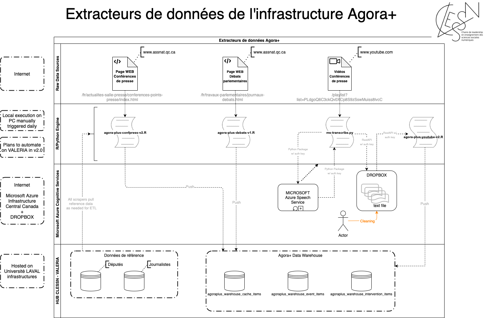

# cless-blend
This repo contains code used to perform the data ETL pipeline between the various data sources required for the CLESSN and the CLESSN HUB

This is the schema of the pipelines implemented to date

